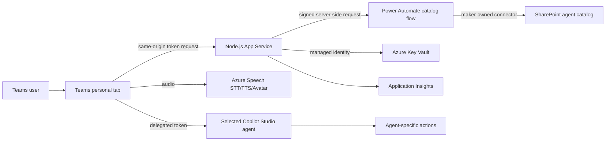

# Voice Agent Catalog for Microsoft Teams

This sample is a reusable Microsoft Teams personal app for talking to one or
more Microsoft-authenticated Copilot Studio agents by text, microphone, neural
voice, and optional real-time avatar.

The app is **not tied to Pat**. Pat is the included reference agent and fallback
configuration. A SharePoint/Microsoft List acts as the live agent catalog. A
business owner can add, disable, rename, describe, or re-style agents without
rebuilding or reinstalling the Teams app.

## What customers receive

- A Teams personal app with an agent dropdown.
- A catalog-driven title, description, welcome message, completion phrase,
  locale, neural voice, avatar character, and avatar style.
- Microsoft Entra sign-in using each user's existing work identity.
- Delegated access to Copilot Studio plus a maker-owned Power Automate bridge
  for the SharePoint catalog.
- Azure Speech STT, TTS, and optional real-time avatar.
- A managed Azure host with Key Vault and Application Insights.
- Pat, a short manager-handoff interview agent that emails an HTML summary, as
  the working example.
- A repository-local Copilot deployment skill that collects customer values and
  performs the installation.

## Experience

1. The user opens **Voice Agents** from Teams.
2. The app uses the user's existing Entra work account for Copilot Studio.
3. App Service reads enabled agents through the maker-owned catalog flow.
4. Selecting an agent changes:
   - **Meet _agent name_**
   - the tagline from the agent's **Description**
   - welcome and completion text
   - speech locale and neural voice
   - avatar character and style
5. The user types or speaks.
6. The selected published Copilot Studio agent handles its own workflow and
   actions.

The Teams app is generic. It does not assume four questions, an email action, or
a manager-handoff workflow. Those are behaviors of the included Pat agent.

## Important identity distinction

The app uses the customer's **existing Entra users**. It does not create new
user identities.

The installation does create one **Entra application registration**. Every
Teams or browser application needs a registration to identify the software,
declare its callback URL, and request delegated permissions. It contains no user
password and does not replace the user's identity.

This sample requests one delegated permission:

| API | Delegated permission | Why |
| --- | --- | --- |
| Power Platform API | `CopilotStudio.Copilots.Invoke` | Invoke the selected published agent as the signed-in user |

The SharePoint connector runs under the flow maker's connection, so app users
do not need Microsoft Graph `Sites.Read.All` consent. The signed HTTP trigger
URL is stored in Key Vault and called only by App Service. If the flow is absent
or unavailable, the app uses its configured default agent.

Inside Teams, the app uses MSAL nested app authentication (NAA). Teams supplies
the current work identity, so there is no separate account login. If the user
has not granted `CopilotStudio.Copilots.Invoke`, first use can show a one-time
permission dialog when tenant policy allows user consent. Browser diagnostics
use the dedicated `/auth/callback` page.

The deployed URL also works in a normal browser for diagnostics, but the
intended customer experience is the installed Teams personal app.

## Architecture



### Responsibility boundaries

| Component | Responsibility |
| --- | --- |
| Teams/React client | Agent picker, transcript, microphone, playback, avatar, and authentication UX |
| SharePoint list | Runtime agent catalog and each agent's visible/speech identity |
| Power Automate flow | Reads the list through a maker-owned SharePoint connection and returns normalized JSON |
| Copilot Studio | Conversation logic, knowledge, topics, tools, and completion behavior |
| Azure Speech | Speech recognition, neural synthesis, and real-time avatar |
| Node.js App Service | Static app host and short-lived Speech credential broker |
| Key Vault | Speech key storage; App Service reads it with managed identity |
| Entra app registration | Single-tenant SPA identity and delegated API declarations |
| Teams app registration | Tenant-specific Teams package and personal tab |
| Application Insights | Operational telemetry without intentional transcript logging |

More detail: [Architecture and security](docs/architecture.md).

## Repository layout

| Path | Purpose |
| --- | --- |
| `src/Tab/` | Generic React agent client and Speech integration |
| `src/index.ts` | Web host, auth callback, health/config routes, and Speech broker |
| `catalog/` | Microsoft List CSV and catalog maintenance guide |
| `copilot-studio/` | Tenant-neutral Pat reference-agent instructions |
| `infra/` | Bicep for App Service, Speech, Key Vault, and monitoring |
| `appPackage/` | Generic Teams application manifest and icons |
| `aad.manifest.json` | Single-tenant SPA registration definition |
| `m365agents.yml` | Agents Toolkit provision, deploy, and package workflow |
| `env/.env.dev.example` | Customer-specific configuration template |
| `.github/skills/deploy-voice-agent-catalog/` | Guided customer deployment skill |
| `docs/` | Installation, architecture, operation, and troubleshooting guides |

## Fastest installation: use the included skill

Open the repository in a GitHub Copilot client that supports Agent Skills and
ask:

```text
Deploy the Voice Agent Catalog sample for my tenant.
```

The skill at
`.github/skills/deploy-voice-agent-catalog/SKILL.md` asks for one value at a time,
tells the installer exactly which account to use for each sign-in, and handles:

1. prerequisites and customer intake;
2. Copilot Studio agent and Outlook action;
3. SharePoint catalog and connector-flow creation;
4. Azure and Entra validation;
5. Teams/Azure provisioning;
6. application deployment;
7. package installation; and
8. end-to-end verification.

Customer values are stored only in ignored local files. Passwords, MFA codes,
tokens, connector credentials, and Speech keys are never collected.

## Manual installation

Use [Customer installation guide](docs/installation.md). At a high level:

1. Create or import a compatible Microsoft-authenticated Copilot Studio agent.
2. Publish it and share it with intended users.
3. Create the SharePoint catalog from
   [`catalog/Pat Agent Catalog.csv`](catalog/Pat%20Agent%20Catalog.csv).
4. Create the catalog flow from
   [`catalog/power-automate-flow.md`](catalog/power-automate-flow.md).
5. Copy `env/.env.dev.example` to `env/.env.dev` and
   `env/.env.dev.user.example` to `env/.env.dev.user`.
6. Validate subscription, region, quota, and Bicep.
7. Run Agents Toolkit provision and deploy.
8. Install the generated tenant-specific Teams package.
9. Run the verification checklist.

## Add another agent without reinstalling Teams

Publish a compatible Microsoft-authenticated agent, share it with users, and add
one enabled SharePoint row containing:

- display name and description;
- environment ID and schema name;
- welcome and completion phrases;
- locale and Azure neural voice;
- avatar character and style.

The app reads the list when the user connects. No Teams package change is
required. See [Catalog administration](catalog/README.md).

## Build

Prerequisites:

- Node.js 22+
- npm 10+
- Azure CLI
- Microsoft 365 Agents Toolkit CLI or VS Code extension
- permissions to create Azure, Entra, Teams, SharePoint, and Copilot Studio
  resources in the customer tenant

```powershell
npm install
npm run build
```

There is currently no automated unit-test suite. The build performs TypeScript,
server bundling, and production Vite compilation. Vite can report a nonblocking
large-bundle warning because the browser includes the Copilot and Speech SDKs.

## Provision and deploy

After completing `env/.env.dev`:

```powershell
npx -y --package @microsoft/m365agentstoolkit-cli atk auth login azure
npx -y --package @microsoft/m365agentstoolkit-cli atk auth login m365

npx -y --package @microsoft/m365agentstoolkit-cli atk provision `
  --env dev --folder . --interactive false

npx -y --package @microsoft/m365agentstoolkit-cli atk deploy `
  --env dev --folder . --interactive false
```

Before each interactive login, tell the installer which customer account to
select. Azure CLI, Agents Toolkit Azure, Agents Toolkit Microsoft 365, and
browser sessions use separate secure token caches.

Provisioning creates a tenant-specific Entra app and Teams app, deploys Azure
resources, applies the Entra manifest, and validates the Teams package.
Deployment builds and ZIP-deploys the application.

Generated package:

```text
appPackage/build/appPackage.dev.zip
```

Install for the current user:

```powershell
npx -y --package @microsoft/m365agentstoolkit-cli atk install `
  --file-path appPackage/build/appPackage.dev.zip `
  --scope Personal --interactive false
```

## Use

1. Open the installed **Voice Agents** personal app in Teams.
2. Select **Connect to _agent_**.
3. Complete the one-time Copilot Studio permission dialog if shown. Teams does
   not require a separate account login.
4. Choose an enabled agent.
5. Type, or select **Start voice conversation** once. After each spoken answer,
   a short pause submits it automatically; after the agent finishes speaking,
   the microphone reopens for the next turn.
6. Select **Stop conversation** to leave automatic voice mode.
7. Turn avatar video off for audio-only mode.
8. Select another agent to reset the conversation and apply its identity.

Pat's reference workflow collects a short manager handoff and sends one HTML
email. Other agents can implement completely different topics, knowledge, and
actions.

For a time-critical demonstration when tenant consent is unavailable, set
`DEMO_MODE=true` in the ignored user environment file and provision again.
This bypasses Copilot authentication and enables two deterministic experiences:

- **Pat** — four-question manager handoff using Ava's voice and Lisa's avatar;
- **Morgan** — order lookup and placement using Andrew's voice and Harry's
  avatar.

Pat displays the completed summary and can open a self-addressed Outlook draft
using the current Teams user's login hint. The user selects **Send** in Outlook;
the sample never stores Outlook credentials or exposes the email in its public
runtime configuration. Morgan's demo tool mirrors the seed data in
`catalog/Voice Agent Orders.csv` for guaranteed offline operation. Keep
`DEMO_MODE=false` for real Copilot Studio and connector-backed deployments.

See [Three-minute customer demo](docs/demo-script.md).

## Verification

After deployment, verify:

- `/api/health` returns `{"status":"ok"}`;
- `/tabs/home` returns HTTP 200 with the expected CSP;
- `brk-multihub://<deployed-domain>` is registered for Teams NAA;
- `/auth/callback` is registered for browser diagnostics;
- the maker-owned flow returns SharePoint catalog rows through `/api/catalog`;
- title/tagline and speech identity change with agent selection;
- typed Copilot invocation works;
- microphone STT, audio TTS, and avatar work;
- agent-specific completion is detected;
- Pat opens a self-addressed Outlook draft in demo mode;
- Morgan can list pending orders, find `ORD-1002`, and place a session order;
- Key Vault reference status is `Resolved`; and
- Application Insights contains operational events but no intentional
  transcript content.

See [Operations and troubleshooting](docs/operations.md).

## Azure services and costs

Actual prices vary by region, date, agreement, and usage.

| Service | Default tier | Cost behavior |
| --- | --- | --- |
| App Service | Linux B1 | Fixed charge while the plan exists |
| Azure Speech | S0 | Usage-based STT/TTS; avatar billed separately by duration |
| Key Vault | Standard | Small per-operation charge |
| Log Analytics | PerGB2018 | Ingestion and retention |
| Application Insights | Workspace-based | Uses Log Analytics |
| Copilot Studio | Customer capacity/PAYG | Copilot Credits by usage |
| Outlook action | Microsoft 365 entitlement | Connector and mailbox limits apply |

Use a region that supports real-time Speech avatars and has App Service quota.
Delete the dedicated POC resource group after testing, subject to customer
approval. Key Vault purge protection can keep a deleted vault recoverable during
its retention period.

## Security and production hardening

This is a POC sample:

- Work accounts and single-tenant authentication are required.
- The Speech key stays in Key Vault and never reaches the browser.
- The browser receives only short-lived Speech and avatar relay credentials.
- Copilot uses a delegated user token; SharePoint uses the configured
  maker-owned connector connection.
- Interview content is not intentionally persisted or logged by this app.
- CSP, HTTPS, TLS 1.2+, FTPS disablement, no-store responses, and basic Speech
  token rate limiting are enabled.

Before production:

- protect `/api/speech/token` with backend bearer-token validation;
- replace in-memory rate limiting with a distributed control;
- define transcript, email, and telemetry retention policies;
- complete privacy, threat-model, accessibility, and penetration reviews;
- restrict the flow URL, SharePoint connection, agents, Teams distribution, and
  mailbox access;
- configure budgets, alerts, incident response, and support ownership.

## Generic GitHub distribution

A built Teams ZIP is tenant-specific because it contains app IDs and deployment
URLs. Distribute source, templates, the deployment skill, catalog CSV, and a
tenant-neutral Power Platform solution—not a ZIP generated for another tenant.

Before publishing, verify tracked files contain no customer email, tenant,
subscription, environment, agent, resource, connection-reference, or absolute
user-profile identifiers. Local values belong in ignored `env/.env.dev`,
`.env.dev.user`, `.azure/`, and local Copilot Studio clone paths.

## Additional guides

- [Customer installation](docs/installation.md)
- [Architecture and security](docs/architecture.md)
- [Operations and troubleshooting](docs/operations.md)
- [Catalog administration](catalog/README.md)
- [Copilot Studio reference agent](copilot-studio/README.md)
