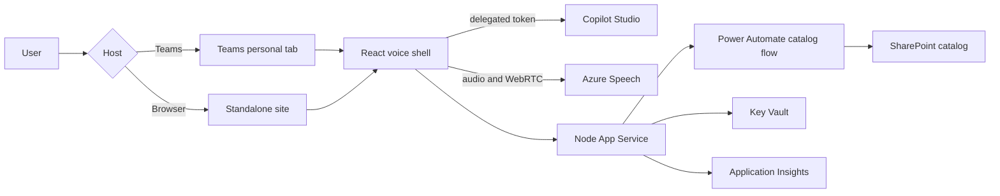

# Voice Agent Catalog

A reusable Azure-hosted voice and avatar shell for Microsoft-authenticated
Copilot Studio agents. Run it as a standalone web application, install it as a
Teams personal app, or submit the Teams package to an organization's app
catalog.

The sample includes:

- text, microphone, neural voice, and real-time avatar experiences;
- separate user-selected spoken input and catalog-controlled output languages;
- safe rendering for agent images, Adaptive Cards, citations, actions, and links;
- a SharePoint-managed multi-agent catalog;
- Teams nested app authentication and standalone browser authentication;
- Azure App Service, Speech, Key Vault, and Application Insights infrastructure;
- an importable Copilot Studio sample-agent solution ZIP; and
- a repository Agent Skill that guides or automates customer installation.

## Table of contents

- [Choose your role](#choose-your-role)
- [Choose a delivery channel](#choose-a-delivery-channel)
- [What is included](#what-is-included)
- [Quick start](#quick-start)
- [Sample agent package](#sample-agent-package)
- [How the solution fits together](#how-the-solution-fits-together)
- [Repository map](#repository-map)
- [Demo mode](#demo-mode)
- [Security and production status](#security-and-production-status)
- [Documentation](#documentation)

## Choose your role

| Role | Use this guide |
| --- | --- |
| **Installer** — deploy Azure, Entra, Teams, SharePoint, and the sample agent | [Installer guide](docs/installer/README.md) |
| **Maker** — import agents, add tools, manage catalog rows, voices, and avatars | [Maker guide](docs/maker/README.md) |
| **Builder** — understand the code and architecture or create a derivative solution | [Builder guide](docs/builder/README.md) |

The complete role and reference map is in the
[documentation hub](docs/README.md).

Agent makers can start with the lightweight
[publish checklist](README-AGENT-MAKERS.md).

## Choose a delivery channel

| Channel | Best for | Distribution |
| --- | --- | --- |
| Standalone web application | Browser access, demonstrations, and non-Teams entry points | Share the Azure App Service or other Node host HTTPS URL |
| Teams personal app | Individual users and pilots | Install the generated Teams ZIP |
| Teams organizational catalog | Controlled tenant-wide rollout | Submit the Teams ZIP to Teams Admin Center |
| Public Teams store | Commercial or broad public distribution | Complete Partner Center and Microsoft certification |

The same React application powers the standalone and Teams experiences. Teams
adds its host context, current work identity, personal-tab navigation, and
tenant distribution controls; it is not a separate Bot Framework bot.

## What is included

### Application

- Agent dropdown driven by SharePoint metadata
- Typed and continuous microphone input
- End-of-turn detection and managed listen/speak/listen flow
- Azure neural TTS
- Optional real-time avatar with audio-only fallback
- Agent-specific output locale, voice, character, style, welcome, and completion text
- User-selectable STT input language that defaults to the output locale
- Agent images, Adaptive Cards, citations, suggested actions, and safe links
- Standalone browser and Teams host support

### Deployment

- Microsoft 365 Agents Toolkit lifecycle
- Single-tenant Entra SPA
- Teams personal-app manifest
- Azure App Service and App Service plan
- Azure AI Speech S0
- Key Vault with managed-identity access
- Application Insights and Log Analytics
- Maker-owned Power Automate bridge to SharePoint

### Samples and automation

- Pat manager-handoff Copilot Studio solution ZIP
- Editable Pat solution source
- Morgan order-management instruction example
- SharePoint catalog and order-list CSV templates
- Three-minute demonstration script
- Agent Skill for GitHub Copilot CLI, Scout, and compatible clients

## Quick start

### Automated installation

Open this repository in a client that supports repository Agent Skills and ask:

```text
Deploy the Voice Agent Catalog sample for my tenant.
```

The installation skill is:

```text
.github/skills/deploy-voice-agent-catalog/SKILL.md
```

It collects one customer value at a time, identifies the correct account before
interactive sign-in, imports or creates the agent, configures the catalog,
validates Azure, deploys the application, packages Teams, and verifies the
result. It never asks for passwords, MFA codes, tokens, Speech keys, or
connector credentials.

See the [installer guide](docs/installer/README.md) for prerequisites, manual
commands, and channel-specific publication steps.

### Build the code

```powershell
npm install
npm run build
```

The build bundles the Node host with tsup and the React client with Vite.

## Sample agent package

Installers can import:

```text
copilot-studio/packages/pat-manager-handoff-solution.zip
```

[Download the Pat manager-handoff solution ZIP](copilot-studio/packages/pat-manager-handoff-solution.zip).

This is a genuine Power Platform solution ZIP produced with
`pac copilot pack`. It creates **Pat Manager Handoff Sample** and its standard
topics.

The package deliberately contains no live Outlook connection, recipient,
tenant ID, environment ID, or credentials. After import, the destination maker
adds **Office 365 Outlook - Send an email (V2)** and configures the approved
recipient by following
[the Outlook action guide](copilot-studio/outlook-action.md).

Editable source and rebuild instructions are in the
[Copilot Studio package guide](copilot-studio/README.md).

## How the solution fits together



Copilot Studio owns conversation behavior and tools. SharePoint owns visible
agent metadata. The reusable application owns channel, authentication, speech,
avatar, and turn-taking UX.

Read the [builder guide](docs/builder/README.md) for runtime sequences, trust
boundaries, extension points, and production hardening.

## Repository map

| Path | Purpose |
| --- | --- |
| `src/Tab/` | React UI, authentication clients, catalog, Speech, and avatar |
| `src/index.ts` | Node host, health/config routes, catalog proxy, Speech broker |
| `infra/` | Azure Bicep and deployment parameters |
| `appPackage/` | Generic Teams manifest template and icons |
| `copilot-studio/` | Importable agent ZIP, editable source, and maker instructions |
| `catalog/` | SharePoint templates, audience schema, and Power Automate flow contract |
| `.github/skills/` | Guided installation Agent Skill |
| `docs/installer/` | Deployment and publication guide |
| `docs/maker/` | Agent and catalog maker guide |
| `docs/builder/` | Architecture and extension guide |
| `docs/operations.md` | Health checks and troubleshooting |

## Demo mode

For a time-critical demonstration when Copilot consent or connectors are not
available, set `DEMO_MODE=true` in the ignored user environment file and
provision again.

Demo mode provides:

- **Pat** — deterministic four-question manager handoff using Ava and Lisa;
- **Morgan** — deterministic order lookup and placement using Andrew and Harry;
- Speech and avatar UX without Copilot Studio invocation; and
- a self-addressed Outlook draft inside Teams rather than automatic email.

Demo mode is intentionally not a substitute for production agent invocation,
SharePoint persistence, or connector-confirmed email delivery. Use the
[three-minute demo script](docs/demo-script.md).

## Security and production status

This repository is a proof-of-concept reference implementation. It applies:

- managed identity and Key Vault for Azure secrets;
- short-lived Speech and avatar relay credentials;
- same-origin backend routes;
- Teams nested app authentication;
- browser MSAL for standalone use;
- maker-owned SharePoint connector access; and
- no intentional transcript persistence.

Before broad production use, add authenticated Speech-broker access,
distributed throttling, automated tests, formal retention and privacy controls,
accessibility validation, threat modeling, operational SLOs, and the required
Teams governance or store-certification work.

Never commit customer emails, tenant/subscription/environment IDs, generated
Teams packages, signed flow URLs, connection identifiers, or credentials. See
[SECURITY.md](SECURITY.md).

## Documentation

- [Documentation hub](docs/README.md)
- [Installer guide](docs/installer/README.md)
- [Maker guide](docs/maker/README.md)
- [Builder guide](docs/builder/README.md)
- [Operations and troubleshooting](docs/operations.md)
- [Catalog administration](catalog/README.md)
- [Copilot Studio sample package](copilot-studio/README.md)
- [Three-minute demo](docs/demo-script.md)
