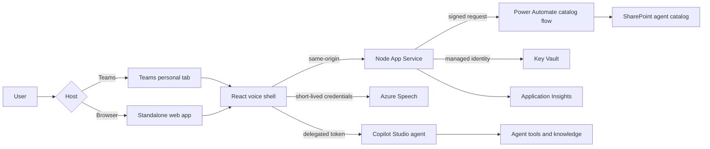

# Builder guide

This guide is for software engineers and architects who want to understand,
extend, fork, or productionize the Voice Agent Catalog.

## Table of contents

- [Architecture goals](#architecture-goals)
- [Delivery channels](#delivery-channels)
- [Runtime components](#runtime-components)
- [Runtime sequences](#runtime-sequences)
- [Authentication model](#authentication-model)
- [Repository structure](#repository-structure)
- [Important extension points](#important-extension-points)
- [Build and local development](#build-and-local-development)
- [Package the sample agent](#package-the-sample-agent)
- [Security and privacy](#security-and-privacy)
- [Production hardening](#production-hardening)
- [Design constraints](#design-constraints)

## Architecture goals

The project separates three concerns:

1. **Conversation behavior** belongs to Copilot Studio.
2. **Agent presentation and routing metadata** belong to the SharePoint catalog.
3. **Channel, speech, avatar, and authentication UX** belong to the reusable
   React/Node shell.

This lets makers add or restyle agents without rebuilding the application while
builders can evolve the channel shell independently.

## Delivery channels

The Node application serves the same React experience in two host contexts:

- **Teams personal tab** — Teams JS initializes first and MSAL nested app
  authentication reuses the Teams identity.
- **Standalone web application** — browser MSAL uses the deployed
  `/auth/callback` SPA redirect.

The Teams manifest is a packaging layer over the hosted site, not a separate
Bot Framework bot. The root web route redirects to `/tabs/home` for standalone
use.

App Service is the included deployment target, not a runtime requirement. The
built Node.js 22 service can run on another HTTPS-capable platform when that
platform supplies the documented environment variables and equivalent secret
management, monitoring, and identity controls.

## Runtime components



| Component | Responsibility |
| --- | --- |
| React client | Agent selection, transcript, turn state, microphone, playback, avatar |
| Node host | Static content, public configuration, catalog proxy, Speech credential broker |
| Copilot Studio | Conversation orchestration, knowledge, topics, actions |
| SharePoint | Agent metadata catalog |
| Power Automate | Maker-owned SharePoint connector bridge |
| Azure Speech | STT, TTS, and real-time avatar |
| Key Vault | Speech key and signed catalog URL |
| Entra app | Single-tenant delegated identity |
| Teams package | Personal-tab channel metadata |

## Runtime sequences

### Agent catalog

1. The browser requests `/api/config`.
2. The browser requests `/api/catalog` when enabled.
3. App Service calls the signed Power Automate trigger.
4. The flow reads SharePoint with its maker-owned connection.
5. The browser validates normalized rows and displays enabled agents.

### Conversation

1. The host identity implementation acquires
   `CopilotStudio.Copilots.Invoke`.
2. The selected environment and schema are passed to the Copilot Studio SDK.
3. Activities are normalized into visible agent messages.
4. The selected completion phrase controls the completed UI state.

### Managed voice turn

1. The user starts voice mode once.
2. Continuous recognition collects finalized speech.
3. End-of-turn silence submits the text.
4. Recognition pauses while the agent speaks.
5. TTS and avatar playback complete.
6. Recognition reopens automatically.

This managed half-duplex model is deliberate. A Teams personal tab does not
receive the native full-duplex media pipeline used by Teams meetings.

## Authentication model

### Teams

- Teams JS initializes before MSAL.
- MSAL nested app authentication uses
  `brk-multihub://<deployed-domain>`.
- The user can see a one-time delegated consent prompt when tenant policy allows
  user consent.

### Standalone browser

- Browser MSAL uses `https://<deployed-domain>/auth/callback`.
- Users authenticate with their existing work account.
- Agent sharing still controls effective access.

### Service-to-service access

- App Service uses managed identity to read Key Vault.
- The SharePoint connector flow owns the SharePoint connection.
- The browser never receives the Speech key or signed flow URL.

## Repository structure

| Path | Purpose |
| --- | --- |
| `src/Tab/App.tsx` | Host initialization, state machine, UI, and turn lifecycle |
| `src/Tab/copilot.ts` | Identity and Copilot Studio/demo clients |
| `src/Tab/speech.ts` | Recognition, synthesis, WebRTC avatar |
| `src/Tab/catalog.ts` | Catalog loading and row validation |
| `src/index.ts` | Node host and backend routes |
| `infra/` | Azure Bicep and parameters |
| `appPackage/` | Teams manifest template and icons |
| `copilot-studio/` | Agent package, source, and maker guidance |
| `catalog/` | SharePoint templates and flow contract |
| `.github/skills/` | Automated installation workflow |
| `docs/` | Role guides and references |

## Important extension points

### Add catalog fields

Extend `AgentDefinition`, backend normalization, catalog validation, the
SharePoint template, and maker documentation together. Reject invalid rows
explicitly rather than silently falling back.

### Add a host channel

Implement host detection and identity acquisition without coupling it to the
conversation client. Keep the backend routes same-origin and preserve the
security headers.

### Add another conversation backend

Implement the `AgentClient` contract and keep turn normalization, completion
behavior, and surfaced errors consistent.

### Add Speech options

Update the catalog contract, `SpeechController`, and maker guide. Validate that
the selected region and avatar character/style support the requested feature.

## Build and local development

```powershell
npm install
npm run build
npm run dev
```

For Teams-aware local launch, use Agents Toolkit with
`m365agents.local.yml`. Production deployment uses `m365agents.yml`.

The production build bundles the Node host with tsup and the React application
with Vite. The development command performs a clean build and starts the local
host; rerun it after source changes.

## Package the sample agent

The editable package source is:

```text
copilot-studio/sample-agent/solution-source/
```

Rebuild the importable ZIP with Power Platform CLI:

```powershell
.\scripts\package-sample-agent.ps1
```

The script packages and unpacks the solution as a structural validation. The
result must also be imported and tested in a clean Power Platform environment.
Do not add live connector connections, recipient addresses, environment IDs,
or credentials to the source or ZIP. The destination maker adds the Outlook
action and authorizes its connection after import.

## Security and privacy

- No transcript persistence is intended.
- Browser tokens remain in MSAL browser storage.
- Speech credentials are short-lived.
- Speech keys and signed trigger URLs remain in Key Vault.
- Customer values live only in ignored environment files.
- Connector success is never inferred from a fallback response.
- Public configuration contains no recipient address or secret.

See [architecture and security](../architecture.md) and
[security policy](../../SECURITY.md).

## Production hardening

Before broad production use:

- authenticate and authorize the Speech broker route;
- use distributed throttling instead of in-memory counters;
- add formal retention, privacy, accessibility, and threat-model reviews;
- define support and incident-response ownership;
- configure budgets, alerts, dashboards, and availability objectives;
- add unit, integration, browser, and deployment tests;
- review Power Automate HTTP trigger licensing and DLP;
- review mailbox sending, auditing, and abuse controls; and
- complete Teams store or organizational catalog governance.

## Design constraints

- Real-time avatars require Speech S0 and a supported region.
- Teams tabs use managed half-duplex turns, not meeting-grade full duplex.
- The catalog flow URL is a secret even though it is an HTTP endpoint.
- Generated Teams packages are tenant-specific and must not be committed.
- A Power Platform solution cannot carry destination connector credentials.
- Demo mode is deterministic and must remain clearly labeled as nonproduction.
